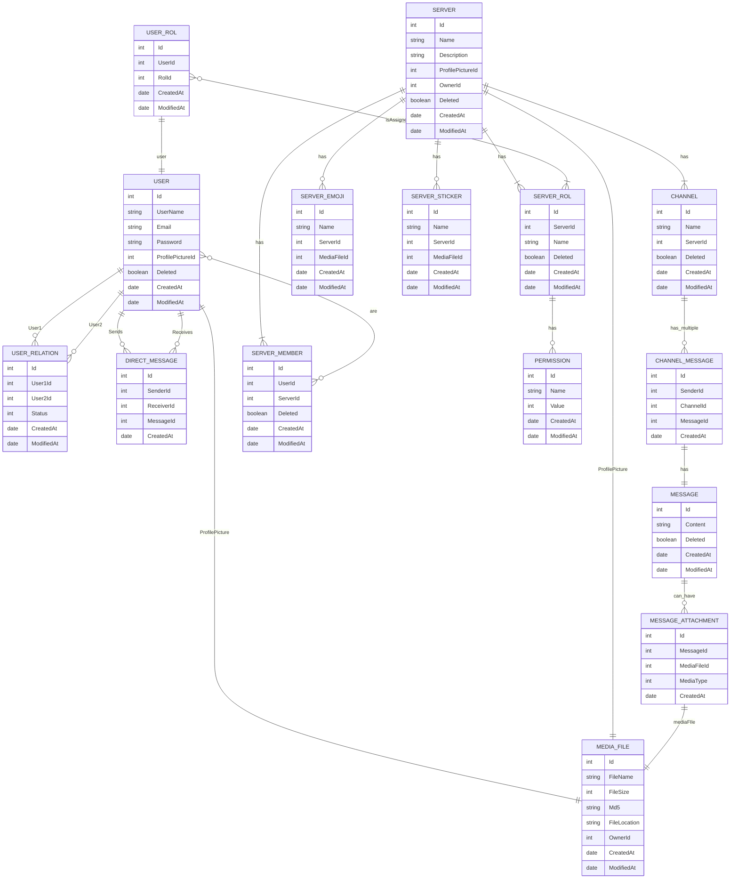

# Analysis:

## Screens and Navigation:

### Landing Page:

Home page of the application. From here users can Login or Register.

### Login:

### Register:

### Direct Message:
After Login or Registration, they get to the Direct Messages page. 
Here users can chat with the users on their Friend List, by selecting them on their friend list.

Before selecting any friend to chat.

Direct Message with a friend.

### Friend Requests:
Users can send friend requests and see their friend requests by clicking on the icons to the right of "Friends: "

Send Friend Request.

Accept Friend Requests.

### User Profile:
By clicking on their username and profile picture at the top right, users can go to their profile. There they can update their profile picture or delete their account.

Clicking their username or profile picture. They can also Log out.

User profile.

### Servers:
At the left, there will be the Server list. The profile picture of the Server will be shwon there. At the bottom there will be a button to create a new Server.

Create Server.

Server messages chat. A list of Channels will be at the left, with a button to create a new Channel.

### Server Configuration:
Clicking on the Server Settings icon, will open the Server configuration. Here users can change the Server profile picture, the Server name, the description and manage Roles, Server Members, Emojis and Stickers.

#### Server Settings:

Server settings.

#### Server Roles: 

List of roles on a Server.

Edit Rol properties.

Edit Rol Permissions.

Edit Rol Members.

Add Member to Rol.

#### Server Members:

List of Server Members

Similar to Add Friend, close to the Server Configuration icon there is an icon to add Users to a Server.

### Server Emojis:

List of Server Emojis

Add or Edit an existing Emoji

### Server Stickers:

List of Server Stickers

Add or Edit an existing Sticker

## Entities:

The aim of this section is to identify the primary entities that will be used on the application, their attributes and their relations.
Here is a short description of the main entities:
- User: Registered user of the platform, with unique username and email.
- Server: Group chat that has Channels.
- Channel: Where users send messages inside a Server. Belongs to a Server.
- DirectMessage: Direct message between two users. The message is stored on the Message table.
- ChannelMessage: Message sent in a Channel. The message is stored on the Message table.
- Message: The text content of the message. Messages attachments will be on its own table.
- MessageAttachment: File attatchment on a message.
- MediaFile: The information of a file uploaded to the platform. It stores information on how to retreive it, not the file itself. User profile pictures, server profile pictures, emojis, stickers and message attachments are stored in this table. It also stores the uploader/owner of this file.
- ServerMember: Each entry represents that a user is member of a Server. A user can be in many Servers, but only once in the same Server.
- UserRelation: Used to represent if two users are friends. The status is if a friend request is pending, accepted or rejected.
- ServerRol: Rol created on a Server.
- UserRol: Rol assigned to a User on a Server.
- RolPermission: Each entry is a permission assigned to a Rol. 
- Permission: The list of permissions that can be assigned to a Rol. These are the same for the whole application and cannot be changed by users.
- ServerEmoji: Emojis uploaded to a Server.
- ServerSticker: Stickers uploaded to a Server.

### Entity attributes:

#### User: 

| Id | UserName | Email | Password | ProfilePictureId | Deleted | CreatedAt | ModifiedAt |
|----|----------|-------|----------|------------------|---------|-----------|------------|

#### Server: 

| Id | Name | Description | ProfilePictureId | OwnerId | Deleted | CreatedAt | ModifiedAt |
|----|------|-------------|------------------|---------|---------|-----------|------------|

#### Channel:
| Id | Name | ServerId | Deleted | CreatedAt | ModifiedAt |
|----|------|----------|---------|-----------|------------|

#### DirectMessage: 
| Id | SenderId | ReceiverId | MessageId | CreatedAt |
|----|----------|------------|-----------|-----------|

#### ChannelMessage: 
| Id | SenderId | ChannelId | MessageId | CreatedAt |
|----|----------|------------|-----------|-----------|

#### Message: 
| Id | Content | Deleted | CreatedAt | ModifiedAt |
|----|---------|---------|-----------|------------|

#### MessageAttachment:
| Id | MessageId | MediaFileId | MediaType | CreatedAt |
|----|-----------|-------------|-----------|-----------|

#### MediaFile:
| Id | FileName | FileSize | Md5 | FileLocation | OwnerId | CreatedAt | ModifiedAt |
|----|----------|----------|-----|--------------|---------|-----------|------------|

#### ServerMember:
| Id | UserId | ServerId | Deleted | CreatedAt | ModifiedAt |
|----|--------|----------|---------|-----------|------------|

#### UserRelation:
| Id | User1Id | User2Id | Status | CreatedAt | ModifiedAt |
|----|---------|---------|----------|-----------|------------|

#### ServerRol:
| Id | ServerId | Name | Deleted | CreatedAt | ModifiedAt |
|----|----------|------|---------|-----------|------------|

#### UserRol:
| Id | UserId | RolId | CreatedAt | ModifiedAt |
|----|--------|-------|-----------|------------|

#### RolPermission:
| Id | ServerRolId | PermissionId | ModifiedAt |
|----|-------------|--------------|------------|

#### Permission:
| Id | Name | Value | CreatedAt | ModifiedAt |
|----|------|-------|-----------|------------|

#### ServerEmoji:
| Id | Name | ServerId | MediaFileId | CreatedAt | ModifiedAt |
|----|------|----------|-------------|-----------|------------|

#### ServerSticker:
| Id | Name | ServerId | MediaFileId | CreatedAt | ModifiedAt |
|----|------|----------|-------------|-----------|------------|

### Entity Relations:

## User Permissions:

For Create, Read, Update and Delete actions that a user can perform, we will use the C.R.U.D. acronym.

What a user can do will depend on what permissions have on each server.

### Unregistered user:

Unregistered users won't be able to access the application, they can login or register.
  - Access to public facing pages (Landing page, Login, Register)
  - Create a user account
  
### Registered User:

- RUD a user account
- Send friend requests, accept friend requests and see their friend list.
- CRUD messages on direct messages.
- CRUD a Server
- CRUD Channels in a Server
- CRUD messages in a Server
- Invite and kick members from a Server. See the members of a Server.
- CRUD Roles and permissions in a Server

## Images:

Users will be able to upload a profile picture when creating an Account. They update their profile picture at any time.

Users will be able to upload a Server picture that will act as a profile picture for the Server.

Users can upload images as part of a message.

Users can upload images to a Server as emojis and stickers.

## Complementary Technologies:

For real time communication, we will use Websockets to keep an open connection between client and server.

For managing backend services communication, as well as infrastructure scalability, we will use a message broker. In this case we will use RabbitMQ

We will use MinIO as a High Performance Object Storage to store user uploaded files. Its API is compatible with Amazon S3

Elasticsearch for message querying.

## Advanced Query:

Users messages querying and filtering will be done with Elasticsearch. Users can search old messages by the content of the message, both in direct messages and in Server Channels. Those results will be paginated.