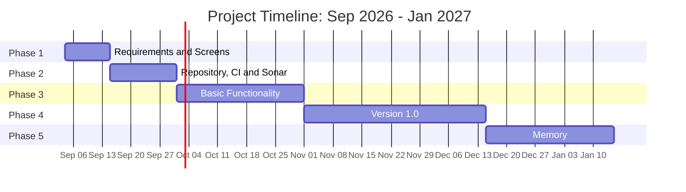

# Approach

This project is designed as a two-parts project. The first one is the development of the Instant Messaging application, and the second part is the cloud deployment of the application, ensuring scalability, and continuous deployment.

This is the approach and planning of the first project:

- Phase 1: Definition of functionalities and Screens of the application (September 15)
- Phase 2: Repository, CI and Sonar configuration (October 1)
- Phase 3: Basic functionality with tests: Unit tests, Integration tests and End to End tests (November 1)
- Phase 4: Version 1.0 - Full functionality and Docker (December 15)
- Phase 5: Memory (January 15)

## Grantt Diagram:

