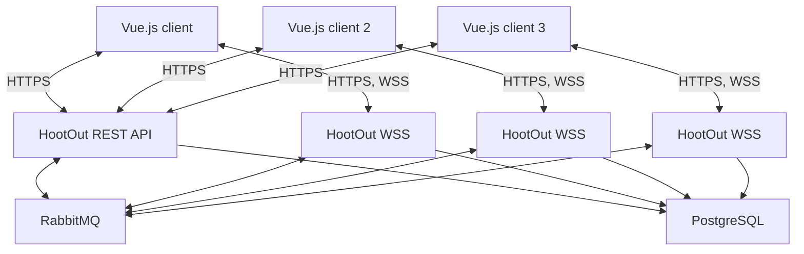

# Development Guide:

## Introduction:

HootOut is a distributed web application, the client application is called frontend and all the server services are called backend. 

The frontend is a Single Page Application ([SPA](https://developer.mozilla.org/en-US/docs/Glossary/SPA)) with [Vue.js 3](https://vuejs.org/).

The backend will consist of two applications built with [ASP.NET Core 10](https://dotnet.microsoft.com/en-us/apps/aspnet). One will be a REST API server and the other a WebSocket server. We will use RabbitMQ as a message broker to handle communication between servers. The main database will be PostgreSQL and later we will include Elasticsearch for searchs.

| Servcie | Type | Technologies | Tools | Quality Assurance | Deployment | Development Proccess |
|---------|------|--------------|-------|-----------------|------------|----------------------|
| Fronted | SPA  | Vue.js 3, HTML, CSS, JS and TS| Visual Studio Code | Vitest, Playwright, Sonar | HTML, CSS and JS artifact | Iterative and incremental with git, CI with Github Actions |
| Backend API | REST API | ASP.NET Core 10 | Visual Studio, Visual Studio Code | XUnit, TestContainers, Microsoft.AspNetCore.Mvc.Testing Sonar | Docker Image | Iterative and incremental with git, CI with Github Actions |
| Backend WebSockets | WebSocket Server | ASP.NET Core 10 | Visual Studio, Visual Studio Code | XUnit, TestContainers, Microsoft.AspNetCore.Mvc.Testing Sonar | Docker Image | Iterative and incremental with git, CI with Github Actions |
| PostgreSQL DB | Relational DB | PostgreSQL v18.6 | pgadmin 4 | | Docker Image, dedicated service | Iterative and Incremental |
| RabbitMQ | Message Broker | RabbitMQ 4.3.6 | Management Plugin | | Docker Image, dedicated service | Iterative and Incremental |

## Technologies:

### Frontend: 

#### [Vue.js](https://vuejs.org/)

Vue is a JavaScript framework for building user interfaces. It builds on top of standard HTML, CSS, and JavaScript and provides a declarative, component-based programming model.

We will use Vue's [Composition API](https://vuejs.org/guide/introduction.html#composition-api) and [Singe-File Componets](https://vuejs.org/guide/scaling-up/sfc.html).

#### [TypeScript](https://www.typescriptlang.org/)

TypeScript is a strongly typed programming language that builds on JavaScript. We will use Vue with Typescript to write type-safe components.

#### [Vite](https://vite.dev/)

Vite is a build tool that aims to provide a faster and leaner development experience for modern web projects. Consists on a dev server that provides rich feature enhancements over native ES modules, for example extremely fast Hot Module Replacement (HMR) and a build command that bundles the code to output highly optimized static assets for production.

### Backend:

#### [ASP.NET Core 10](https://dotnet.microsoft.com/en-us/apps/aspnet) 

.NET is a developer platform made up of tools, programming languages, and libraries for building many different types of applications.

ASP.NET Core extends the .NET developer platform with tools and libraries specifically for building web apps. It's Cross-platform and Open source, and we will use it with C#.

#### [PostgreSQL](https://www.postgresql.org/)

PostgreSQL is a powerful, open source object-relational database system that uses and extends the SQL language combined with many features that safely store and scale the most complicated data workloads.

PostgreSQL has earned a strong reputation for its proven architecture, reliability, data integrity, robust feature set, extensibility, and the dedication of the open source community behind the software to consistently deliver performant and innovative solutions. PostgreSQL runs on all major operating systems, has been ACID-compliant since 2001, and has powerful add-ons

#### [Autofac](https://autofac.org/)

Autofac is an addictive Inversion of Control container for .NET Core, ASP.NET Core and more.

#### [Npgsql](https://www.npgsql.org/) 

Npgsql is an open source ADO.NET Data Provider for PostgreSQL, it allows programs written in C#, Visual Basic, F# to access the PostgreSQL database server. It is implemented in 100% C# code, is free and is open source.

#### [Dapper](https://github.com/dapperlib/dapper)

Dapper is an open-source object-relational mapping (ORM) library for .NET and .NET Core applications. The library allows developers to quickly and easily access data from databases without the need to write tedious code. Dapper allows you to execute raw SQL queries, map the results to objects, and execute stored procedures, among other things. It is available as a NuGet package.

Dapper is lightweight and fast, making it an ideal choice for applications that require low latency and high performance.

#### [RabbitMQ](https://www.rabbitmq.com/)

RabbitMQ is a powerful, enterprise grade open source messaging and streaming broker that enables efficient, reliable and versatile communication for applications — perfect for distributed microservices, real-time data, and IoT. RabbitMQ is Free and Open Source

## Tools:

#### [Visual Studio Code](https://code.visualstudio.com/)

Visual Studio Code is an IDE developed by Microsoft for Windows, Linux, macOS and web browsers. It has extensions to add functionality and to support most programming languages. 

Features include support for debugging, syntax highlighting, intelligent code completion, snippets, code refactoring, and embedded version control with Git. Visual Studio Code provides a fully featured integrated terminal that opens at the root of the current workspace

#### [Visual Studio 2026](https://visualstudio.microsoft.com/es/)

Visual Studio is and IDE developed by Microsoft. It supports syntax highlighting and code completion using IntelliSense for variables, functions, methods, loops, and LINQ queries. Visual Studio includes a debugger that works both as a source-level debugger and as a machine-level debugger. Visual Studio allows developers to write extensions for Visual Studio to extend its capabilities. These extensions "plug into" Visual Studio and extend its functionality. Extensions come in the form of macros, add-ins, and packages. 

#### [Docker](https://www.docker.com/)

Docker is a set of products that uses operating system-level virtualization to deliver software in packages called containers. Docker automates the deployment of applications within lightweight containers, enabling them to run consistently across different computing environments.

#### [OpenAPI V3](https://www.openapis.org/)

The OpenAPI Specification (OAS) defines a standard, programming language-agnostic interface description for HTTP APIs, which allows both humans and computers to discover and understand the capabilities of a service without requiring access to source code, additional documentation, or inspection of network traffic. 

## Architecture:

### Deployment:

The Frontend compiled at build time, and generates an HTML, CSS and JS file. These three files. This is the client code.

The Backend is compiled at build time and there will be 2 services, HootOut Rest API and HootOut Websocket. It is expected to have a few instances of the REST API service, but many more HootOut WebSocket services to handle real time WebSocket communication. They will sync by messages using RabbitMQ, and the data will be stored on PostgreSQL.



### REST API Documentation

The REST API will be documented with OpenAPI, and can be found in this repository on the [/docs/api folder](/docs/api/).

[An online version can be checked at raw.github following this link](https://raw.githack.com/codeurjc-students/2026-HootOut/main/docs/api/api-docs.html).

## Quality Assurance:

### Automatic Testing:
Automatic testing is in place for both backend and frontend. 

- Unit tests are meant to test isolated pieces of code (functions, classes) without dependencies.
- Integration tests are meant to test larger parts of the aplication (services, workflows) and their interaction with their dependencies. These tests can interact with external components (like databases). In our backend tests, these external components will be managed with TestContainers.
- Backend API tests are meant to test api endpoints (urls) rather than internal parts of the application. They are used to validate the content of the replies/responses. 
- Frontend component tests are used to validate Vue.js components behavior mocking the backend API.
- Frontend E2E tests are used to validate the browser behavior of the frontend, making API requests to the backend.

**Since the project is still on a very early stage of development, most of the existing tests are meant to be a guide for future testing**

### Frontend:

#### Unit Testing and Component Testing:

We will use [Vitest](https://vitest.dev/) for Unit and Component testing. We will also use @vue/test-utils.

Test can be run with npm:
```sh
npm run test:unit
```
And this will be the ouptut at this stage.


#### E2E Testing with Playwright:
We will use [Playwright](https://playwright.dev/) for E2E testing. These tests require a the backend to be running. They will generate at the end a test report, and will run the tests on various browsers.


After running ```npx playwright show-report``` we can open the report on the browser


Here we test that the user list on the page is not empty.


Here we tests the interaction with the webSocket server, where it returns "HELLO FROM THE SERVER " + the messaged to uppercase.


### Backend:

### Unit Testing

We use [xUnit.net v3 MTP v2](https://xunit.net/?tabs=cs) as the testing framework along with [Fluent Assertions](https://fluentassertions.com/). For unit tests, we use [Moq](https://github.com/devlooped/moq) as our mocking library. We separate the unit test of a project on their UnitTest project.

This is a output example of running: (We ignore exit code 8 is because we only run Unit Tests Projects and we skip Integration Tests projects)
```sh
dotnet test --filter DisplayName~UnitTests --ignore-exit-code 8
```


### Backend Integration and API Testing

We use the same tools we use on Unit Testing (xUnit, Moq, FluentAssertions) and we add [TestContainers](https://dotnet.testcontainers.org/) to run Docker containers we need for testing (like PostgreSQL container).

For API testing, we have API Integration test projects, and we use [ASP.NET Core MVC Tesing](https://www.nuget.org/packages/Microsoft.AspNetCore.Mvc.Testing). We start the API server and we send it requests with a test client.

This is a output example of running:
```sh
dotnet test --filter DisplayName~IntegrationTests --ignore-exit-code 8
```


To run all the test we can simply run:
```sh
dotnet test
```


### Static Code Analysis with Sonar:

We added [SonarQube](https://www.sonarsource.com/products/sonarqube/) code analysis to have insights and traceability of code coverage, analytics, etc. We set up a project for the Backend and another one for the Frontend. We can see the results on a dashboard on SonarCloud


For the Backend we use [dotnet-coverage](https://www.nuget.org/packages/dotnet-coverage) to get all the tests coverage results, and for the Frontend we use [V8 Code Coverage](https://v8.dev/blog/javascript-code-coverage)

As of now, we don't have any real functionality implemented, but we have Sonar setup for the future. We added it to the CI pipeline to generate reports on pull request to main and on code changes in main.

#### Frontend Summary:


#### Backend Summary:


## Development Process:

### Tasks Management:
The development process is iterative and incremental, following Agile principles and Extreme Programming and Kanban practices.

There is a Github Project with a Kanban board, where Github Issues are the tasks to be completed. They are first added to the Backlog, and then moved to different columns following the task progress (Ready, In Progress, In Review, Done).

Since this is the end of Phase 2, most items are on the Done column.


If we click on an issue, we can see its timeline, the branch or pull request associated to it, and comments made during development.


### Git

This project uses Git as its version control software. We use GitFlow as the branching strategy. For each new issue, we create a new branch from main following the pattern "gh-$issueNumber/issue-short-name". When the task is ready to review, a pull request to merge into main is created. After review, we merge the pull request into main and delete the feature branch to have a clean git environment.

There are only the main branch and the branches that are in development


We can see the pull requests merged into main.


Since it is an iterative and incremental process, commits are being made over time.


On the [Network graph](https://github.com/codeurjc-students/2026-HootOut/network), we can see how feature branches are coming in and out of main.


### Continuous Integration

We have setup Github Actions as our Continuous Integration pipeline. We configure them with Workflows.

We have a basic workflow called "push-unit-tests-workflow.yml" that runs each time we push commits to origin (github). In this workflow be build the applications and we run the Unit Tests. They run only if there are changes on the /backend or /frontend folder.


We have a complete workflow called "pr-main-tests-workflow.yml" that runs each time we open, synchronize or reopen a pull request to main and when we merge the pull request to main. It builds the applications, runs all the tests (unit, integration, e2e) and uploads a new Sonar scan.
The workflow also generates a Playwright result artifact that we can check locally with the command:
```sh
npx playwright show-report playwright-report.zip
```


## Code Editing and Execution:

### Cloning the repository:

To download the repository, you can go to the [Github HootOut Page](https://github.com/codeurjc-students/2026-HootOut) and download as a .zip file.

To clone the repository, you need [git](https://git-scm.com/) installed on your system, and in a Terminal run the following command:

```sh
git clone https://github.com/codeurjc-students/2026-HootOut.git
```

### Project Execution and Testing

Each project has its own README.md with instructions on how to run and test locally these projects:

- [Backend Readme](/backend/README.md)
- [Frontend Readme](/frontend/README.md)